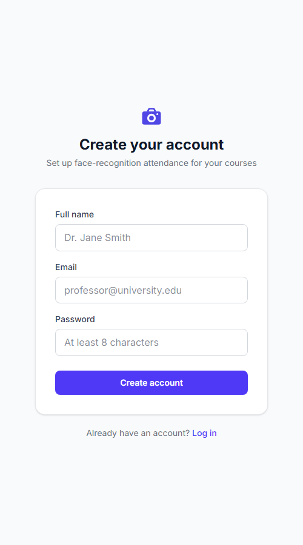
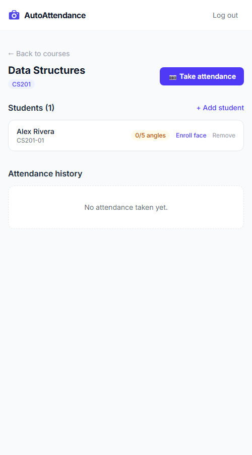
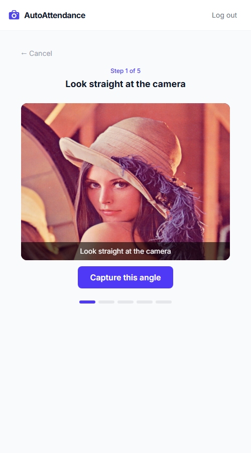
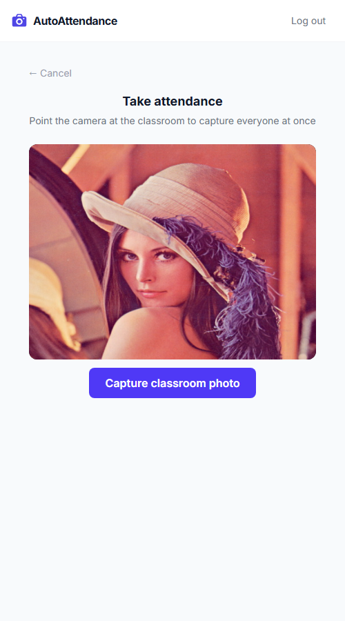
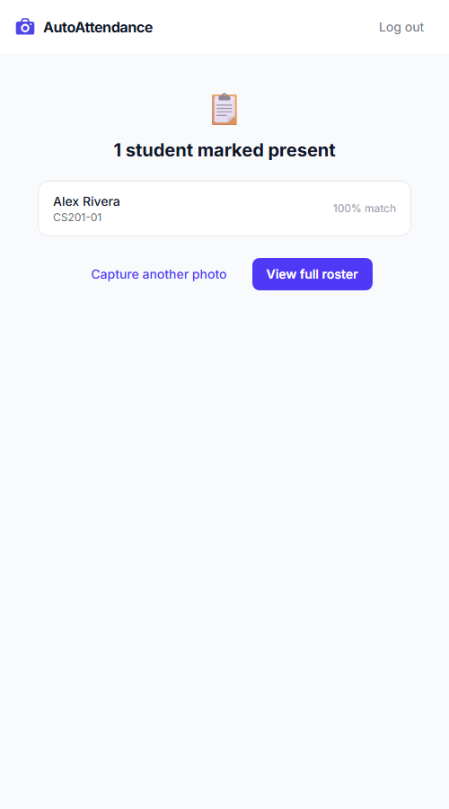

# AutoAttendance

Face-recognition-based classroom attendance. Each professor enrolls their students once
(a guided 5-angle capture per student), then takes attendance by pointing a phone or
laptop camera at the classroom — every enrolled face in the photo is detected and matched
in one shot, scoped to that course's roster only.

## Demo

<table>
  <tr>
    <td></td>
    <td></td>
  </tr>
  <tr>
    <td align="center"><em>Signup — professor account creation</em></td>
    <td align="center"><em>Course dashboard — roster with enrollment status</em></td>
  </tr>
  <tr>
    <td></td>
    <td></td>
  </tr>
  <tr>
    <td align="center"><em>Guided 5-angle face enrollment</em></td>
    <td align="center"><em>Attendance capture — one classroom photo</em></td>
  </tr>
  <tr>
    <td colspan="2"></td>
  </tr>
  <tr>
    <td colspan="2" align="center"><em>Result — matched students with confidence scores</em></td>
  </tr>
</table>

## Why this design

- **Multi-tenant**: each professor logs in and manages their own courses independently.
- **BYOD**: no dedicated kiosk hardware — any browser with a camera works (phone or laptop).
- **Per-course-scoped matching**: face matching only searches the enrolled students of the
  specific course being taken, not the whole university — this keeps 1:N identification
  accuracy high regardless of total institution size.
- **Multi-angle enrollment**: 5 guided captures (front/left/right/up/down) per student
  improve real-world matching robustness versus a single enrollment photo.
- **Multi-face detection**: one classroom photo is enough — every face in frame is detected
  and matched in a single request, not one student at a time.
- **Liveness detection**: a printed photo or screen replay held up to the camera is rejected
  before it ever reaches matching — face recognition alone can't tell a live person from a
  photo of one.

## Accuracy

Benchmarked against the public LFW (Labeled Faces in the Wild) dataset —
[notebooks/face_accuracy_benchmark.ipynb](notebooks/face_accuracy_benchmark.ipynb) — using
InsightFace's `buffalo_s` model (CPU-only detection + recognition, no GPU needed):

| Course roster size | 1:N accuracy |
|---------------------|--------------|
| 10 students          | 100.0%       |
| 30 students          | 98.5%        |
| 60 students           | 98.5%        |
| 100 students          | 99.0%        |
| 300 students          | 99.0%        |

This is a conservative baseline (single enrollment photo per person in the benchmark); the
production app's 5-angle enrollment should improve on it further. LFW photos are also
better-lit and more front-facing than a typical classroom webcam shot, so real-world
accuracy will vary with lighting and camera angle — see the notebook's conclusion for the
full honest caveat.

## Stack

- **Backend** (`backend/`): FastAPI, async SQLAlchemy (asyncpg), PostgreSQL, PyJWT + Argon2
  (`pwdlib`) — owns auth, courses/students, and Postgres; has zero ML dependencies itself
- **Face worker** (`face-worker/`): a separate stateless FastAPI microservice doing face
  detection + embedding (InsightFace `buffalo_s`, ONNX runtime, CPU) + liveness in one
  `/analyze` call per image, mirroring [CompreFace](https://github.com/exadel-inc/CompreFace)'s
  API-server/embedding-server split — no DB access, horizontally scalable independent of the
  main API. The backend talks to it over HTTP (`app/services/face_client.py`).
- 512-d embeddings live in a `pgvector` column with an HNSW index — matching is a single
  indexed nearest-neighbor SQL query (`app/services/matching.py`), not a Python loop over the
  whole gallery
- **Frontend**: React + TypeScript + Vite, Tailwind CSS, browser `getUserMedia` for camera
  capture (no native app needed)

## Vector search at scale

`scripts/benchmark_vector_search.py` seeds a synthetic 10,000-embedding course gallery and
times the old brute-force Python approach against the pgvector HNSW-indexed query:

| Approach | p50 | p95 | mean |
|---|---|---|---|
| Brute-force (Python loop) | 276.7 ms | 348.7 ms | 288.9 ms |
| pgvector HNSW (SQL) | 9.8 ms | 14.0 ms | 10.2 ms |

**~28x faster** at 10k embeddings — a gap that doesn't show up at this project's real
current scale (a handful of enrolled students) but matters as courses/students grow.

## Liveness / anti-spoofing

Both enrollment and attendance-marking run every detected face through
[MiniFASNetV2-SE](https://github.com/facenox/face-antispoof-onnx) (quantized ONNX, ~600KB,
~98% accuracy on 70k+ real/spoof samples, Apache 2.0) before accepting it — rejecting a
printed photo or a phone/screen held up to the camera. Enrollment hard-rejects on a spoofed
face (`422 spoof_detected`); a spoofed face during attendance-marking is excluded from
matching without failing the whole classroom photo (tracked separately from
`unmatched_face_count` as `spoofed_face_count`, since "spoofing attempt" and "a stranger's
face doesn't match anyone enrolled" are different signals worth telling apart in logs/metrics).

## Commands

```bash
# Backend
cd backend
python -m venv venv && venv\Scripts\activate   # Windows
pip install -r requirements.txt
cp .env.example .env   # set DATABASE_URL, JWT_SECRET
uvicorn app.main:app --reload --host 0.0.0.0 --port 8000

# Frontend (dev)
cd frontend
npm install
npm run dev   # http://localhost:5173

# Frontend (production build)
cd frontend
npm run build
```

- API docs: `http://localhost:8000/docs`
- Health: `http://localhost:8000/health`

## API overview

| Endpoint | Purpose |
|----------|---------|
| `POST /auth/signup`, `/auth/login` | Professor account auth (JWT) |
| `POST /courses`, `GET /courses` | Course CRUD, scoped to the logged-in professor |
| `POST /courses/{id}/students` | Add a student to a course roster |
| `POST /courses/{id}/students/{id}/enroll-face?angle_label=front` | Upload one enrollment angle |
| `POST /courses/{id}/attendance/sessions` | Start a new attendance session |
| `POST /courses/{id}/attendance/sessions/{id}/mark` | Upload a classroom photo — enqueues async processing, returns `202 {job_id}` |
| `GET /courses/{id}/attendance/sessions/{id}/jobs/{job_id}` | Poll a mark-attendance job (`pending`/`processing`/`done`/`failed`) |
| `GET /courses/{id}/attendance/sessions/{id}` | Full present/absent roster for a session |

## Async attendance processing

`mark` no longer blocks the request on face-worker + matching — a multi-face classroom
photo can take a few seconds, which shouldn't tie up an HTTP thread. The API enqueues a job
to Redis (`arq`); a separate worker process (`arq app.worker.WorkerSettings`) picks it up,
calls face-worker, runs pgvector matching, and writes the result to the `attendance_jobs`
row for the frontend to poll. Only attendance-**marking** is queued — enrollment is a single
small image with a professor waiting mid-wizard, already sub-second, so queuing it would add
latency for no benefit. Redis runs with AOF persistence so a Redis restart doesn't drop
queued jobs; verified that a job submitted while the worker is down stays queued and
completes once the worker comes back, rather than being silently lost.

On the frontend, `TakeAttendance.tsx` moves to a "processing…" screen the instant the photo
uploads instead of blocking on the old synchronous response, then polls
`GET .../jobs/{job_id}` (`pollJobStatus` in `client.ts`, ~1.5s interval) until the job reaches
`done` or `failed` — matched students and spoofed/unmatched counts render once the job
actually finishes, whether that's one second or several.

## Observability

The Docker Compose stack ships the standard "three pillars" alongside the app:
[Prometheus](https://prometheus.io) (metrics), [Loki](https://grafana.com/oss/loki/) +
[Promtail](https://grafana.com/docs/loki/latest/send-data/promtail/) (logs — Promtail ships
Docker's own container logs, no parsing pipeline needed since they're already structured JSON
from `structlog`), [Tempo](https://grafana.com/oss/tempo/) (traces), and
[Grafana](https://grafana.com/oss/grafana/) with datasources/dashboards provisioned as code
(`observability/`). One dashboard (`observability/grafana/dashboards/autoattendance.json`)
covers API request-latency percentiles, face-match-confidence distribution, liveness-reject
rate (split by `enroll`/`mark` context), and attendance-marking queue depth (`ZCARD
arq:queue`, exposed as a Prometheus gauge in `app/core/metrics.py`).

Tracing (`opentelemetry-instrumentation-fastapi`/`-httpx`, OTLP export to Tempo) covers the
API and face-worker automatically, but an arq job crossing the Redis queue boundary doesn't
carry an HTTP trace header the way a normal request hop would — the enqueueing request
manually `inject()`s its `traceparent` into the job's arguments
(`app/api/attendance.py`), and the worker task `extract()`s it back into a parent span
context before running (`app/tasks/attendance_tasks.py`), so one trace genuinely spans
request → enqueue → dequeue → face-worker call → DB write, verified end to end against a real
`mark` request. Tracing is a no-op outside Compose (`OTEL_EXPORTER_OTLP_ENDPOINT` unset) since
Tempo doesn't exist wherever Compose isn't running (e.g. a bare local venv).

## Deployment

Live at **https://autoattendance.zrik.tech** on Oracle Cloud's Always Free tier
(`VM.Standard.A1.Flex`, 4 OCPU / 24GB ARM Ampere), fronted by Nginx + Let's Encrypt SSL
(certbot, auto-renewing). The app itself (api, arq-worker, face-worker) plus the full
observability stack run as Docker Compose services (`docker-compose.prod.yml`); the old
bare systemd + venv services (`autoattendance`, `autoattendance-arq-worker`) are stopped and
disabled but not deleted, kept only as a rollback path. **Postgres stays the native
apt-installed instance** (never containerized, at every phase of this rebuild) since it's
irreplaceable data, not a stateless service; containers reach it via `host.docker.internal`
(`extra_hosts: host-gateway`) with a `pg_hba.conf` rule scoped to Docker's private bridge
range and password auth, same as any other client. Redis, unlike Postgres, *is* containerized
in production, since it only ever holds transient attendance-marking job state rather than
durable records.

Reaching the native Postgres from a container needed two host-level changes beyond the
`pg_hba.conf` rule: `listen_addresses = '*'` (it only listened on loopback before), and — the
one that actually broke the first cutover attempt — an iptables `INPUT` rule explicitly
accepting `tcp dpt:5432` from Docker's private range, since Oracle's default iptables setup
has a catch-all `REJECT` at the end of `INPUT` that a bridge-network container's connection
to the host hits just like any other unlisted port. `extra_hosts: host-gateway` also turned
out to resolve to the *default* `docker0` bridge's gateway rather than this project's own
compose network's gateway (a different, unreachable bridge) — `docker-compose.prod.yml` pins
`networks.default.ipam` to a fixed subnet and hardcodes the matching gateway IP instead.

Production images are built for `linux/arm64` and pushed to GHCR via a manual
(`workflow_dispatch`-only) CI job, `.github/workflows/build-images.yml` — deliberately not
wired to run on every push, given how much more is riding on a production deploy step than a
CI test run. Deploying is still a manual step on the VM itself:

```bash
docker compose -f docker-compose.prod.yml pull
docker compose -f docker-compose.prod.yml up -d
```

Grafana/Prometheus/Tempo aren't exposed publicly — they bind to `127.0.0.1` on the host and
are reached over an SSH tunnel: `ssh -L 3001:127.0.0.1:3001 <host>`, then
`http://localhost:3001`.
